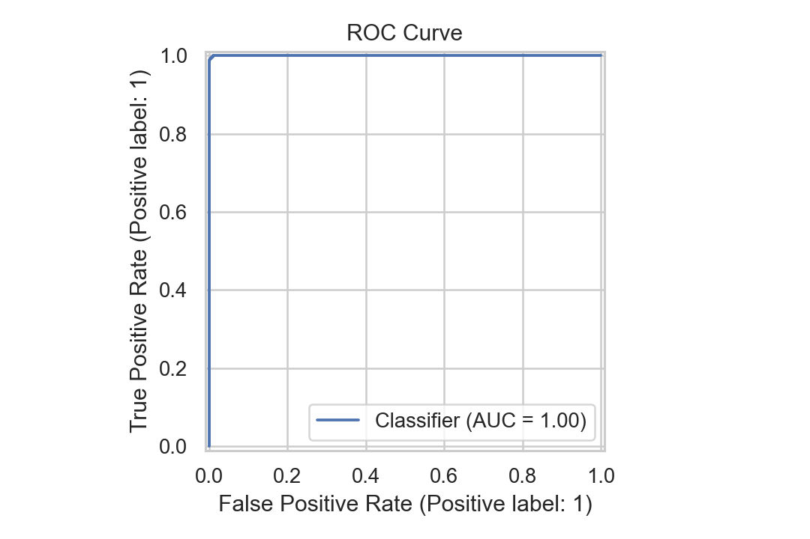
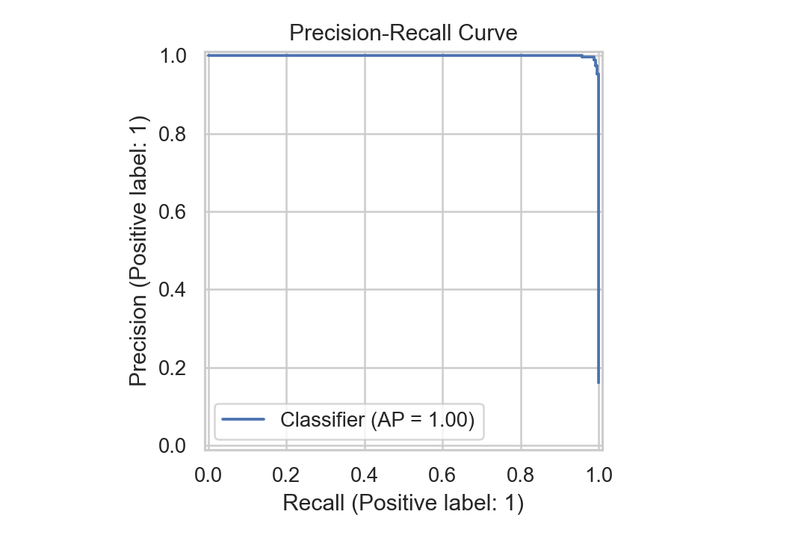
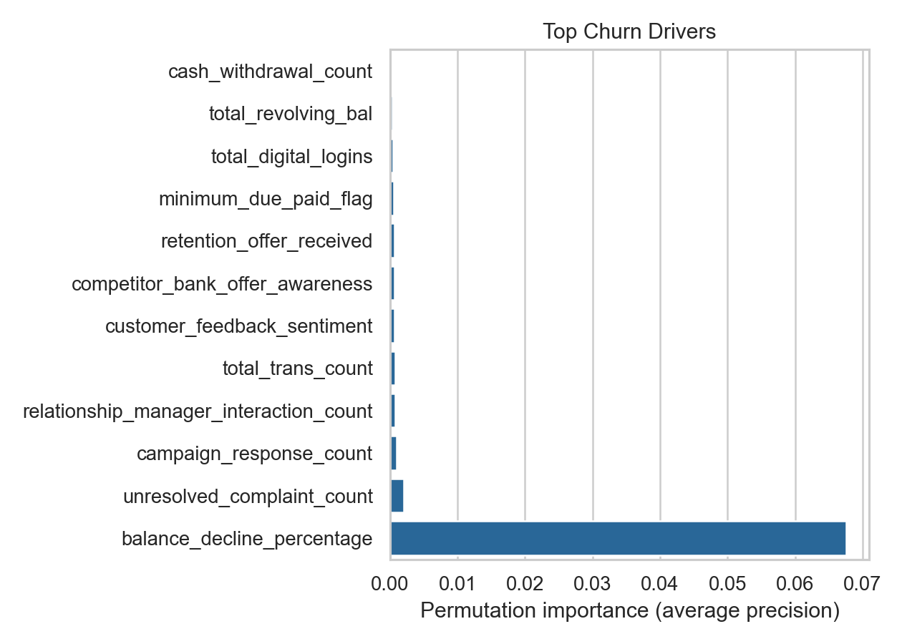
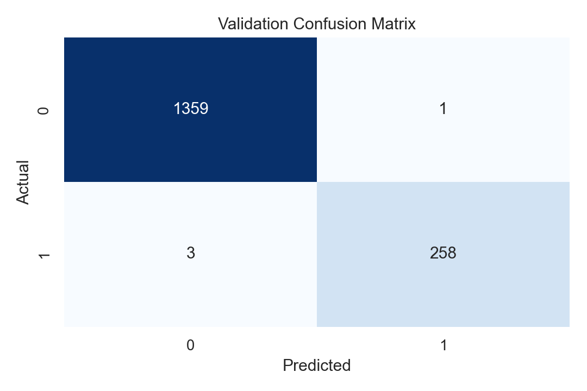

# ChurnZero 26 - Banking Customer Churn Prediction


Round 2 submission for **ChurnZero 26 by IIT Kharagpur**. This repository builds a reproducible machine learning pipeline for predicting banking customer churn, exporting test-set predictions, and generating a presentation-ready case-study deck.

## Team

| Role | Name |
| --- | --- |
| Team Leader | Dharmender Chauhan |
| Member | Rishita Sorout |

## What This Repo Delivers

- End-to-end churn prediction pipeline for banking customer data.
- Schema-tolerant preprocessing for numeric and categorical features.
- Soft-voting ensemble using Extra Trees and Histogram Gradient Boosting.
- Validation metrics, feature importance, and diagnostic plots.
- Test-set prediction export in CSV format.
- Auto-generated Round 2 PPTX deck.

## Visual Report

| ROC Curve | Precision-Recall Curve |
| --- | --- |
|  |  |

| Churn Drivers | Confusion Matrix |
| --- | --- |
|  |  |

## Project Structure

```text
.
├── data/
│   ├── raw/                 # Place official Unstop train/test files here
│   └── sample/              # Synthetic sample data for local verification
├── models/                  # Local trained model artifacts
├── outputs/                 # Metrics and prediction CSV outputs
├── reports/figures/         # Validation charts used in README and deck
├── scripts/
│   ├── make_sample_data.py
│   ├── train.py
│   ├── predict.py
│   └── make_deck.py
├── src/churnzero/           # Reusable data, feature, model, and report code
├── submission/              # Generated PPTX deck
└── tests/                   # Pipeline smoke tests
```

## Quick Start

Install dependencies:

```powershell
pip install -r requirements.txt
```

Run the complete demo workflow:

```powershell
python scripts/make_sample_data.py
python scripts/train.py --train data/sample/train.csv --test data/sample/test.csv --target Exited
python scripts/make_deck.py
```

Run tests:

```powershell
python -m unittest discover -s tests
```

## Official Round 2 Run

Place the official competition files here:

```text
data/raw/train.csv
data/raw/test.csv
```

Then run:

```powershell
python scripts/train.py --train data/raw/train.csv --test data/raw/test.csv --target Exited
python scripts/make_deck.py
```

If the target column is not named `Exited`, replace it with the official target column:

```powershell
python scripts/train.py --train data/raw/train.csv --test data/raw/test.csv --target Churn
```

## Generated Outputs

```text
models/churn_model.joblib
outputs/predictions.csv
outputs/metrics.json
reports/figures/confusion_matrix.png
reports/figures/roc_curve.png
reports/figures/precision_recall_curve.png
reports/figures/feature_importance.png
submission/ChurnZero_26_Round2_Presentation.pptx
```

## Modeling Summary

The model treats churn as a binary classification problem and optimizes both probability ranking and decision quality:

- median imputation and scaling for numeric fields
- most-frequent imputation and one-hot encoding for categorical fields
- automatic dropping of IDs, names, and high-cardinality text leakage risks
- class-weighted ensemble modeling for imbalance handling
- validation threshold selected by F1 score
- permutation importance for explainable churn drivers

## Submission Checklist

Round 2 expects:

- PPTX/PDF case-study presentation
- GitHub repository link with reproducible model code
- predictions CSV on the official test set

Use [SUBMISSION_CHECKLIST.md](SUBMISSION_CHECKLIST.md) before uploading on Unstop.
